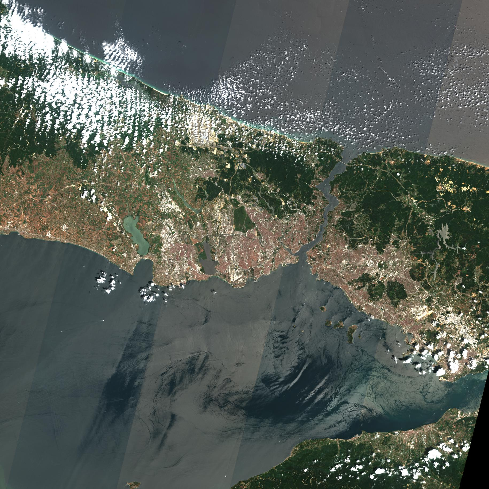

# Sentinel Uyduları ve Veri İndirme Kodları

Bu proje Sentinel uydusu tarafından sağlanan verilerinin otomatik olarak indirilmesi ve arşivlenmesinde kullanılan betiklerin versiyon kontrolünün sağlanması amacıyla oluşturulmuştur.

## Sentinel
Sentinel uyduları Avrupa Birliği ve ESA ortaklığıyla yürütülen Kopernik Programı çerçevesinde faaliyet gösteren uydulardır. Bu uydulardan toplanan veriler kayıtlı tüm kullanıcılara açık bir şekilde dağıtılmaktadır. Bu uydulardan toplam $5$ farklı görev kapsamında veriler toplanmıştır. Toplanan veriler [EO Browser](https://apps.sentinel-hub.com/eo-browser) sitesinden incelenebilmektedir.

### Sentinel 1
C bant Sentetik Açıklıklı Radar ile elde edilen görüntülerden oluşmaktadır. Görüntüler en az 5m çözünürlük ile toplanmıştır. 

### Sentinel 2
Yüksek çözünürülüklü multi spektral imgelerin toplanması amaçlanan bir görevdir. İki farklı uydunun 180 derece faz farkı ile aynı orbitte gezmesi ile elde edilen verilerden oluşur. Veriler $13$ farklı bantta toplanmaktadır. $4$ bant 10m, $6$ bant 20m, $3$ bant ise 60m uzamsal çözünürlüğe sahiptir. Ekvator üzerindeki bir bölgeyi tekrar ziyaret etme süresi ortalama 5 gündür.

Veriler ürün tipine göre, 1C ve 2A olmak üzere iki sınıfa ayrılmıştır. Bu sınıflarda yer alan veriler 100x100 km2 alanı kapsayacak şekilde gruplara bölünmüştür. Bu gruplar KML formatında tüm Dünya yüzeyini kapsayacak şekilde  [paylaşılmıştır](https://sentinels.copernicus.eu/documents/247904/1955685/S2A_OPER_GIP_TILPAR_MPC__20151209T095117_V20150622T000000_21000101T000000_B00.kml).

### Sentinel 3
İklimsel değişikliklerin ve çevresel gözlemlerin yapılması amacıyla kullanılan bir uydudur. Deniz, okyanus ve kara yüzeylerinden alınan topoloji, sıcaklık ve renk verilerinden oluşur.

OLCI alt modülü renk verilerini toplamak için geliştirilmiştir. Bu modül $300$m uzamsal çözünürlükte, $[0.4-1.02]$ $\mu$m aralığında, $21$ spektral bantta veri toplamaktadır.

SLSTR modülü sıcaklık verilerini toplamak için geliştirilmiştir. Bu modül $500$m uzamsal çözünürlükte görünür ve SWIR, $1000$m uzamsal çözünürlükte MWIR ve LWIR(TIR) görüntüler toplamaktadır.

### Sentinel 4
Bu uydu, Avrupa üzerindeki hava kalitesini gösteren gaz (NO2, O3, SO2, HCHO, ...) ve aerosollerin gözlenmesi amacıyla kullanılmaktadır. UV bölgesinden alınan yüksek çözünürülüklü görüntülerden oluşmaktadır.

Sensörler $[305-500]$ nm  ve $[750-775]$ nm aralığında, 8x8 km2 uzamsal çözünürlükle veri toplamaktadır.

[Sentinel veriseti](https://scihub.copernicus.eu/dhus/#/home) adresi üzerinden görsel arama ile toplanabilir. Görsel arama sonucu indirilen veriler [Kopernik Sentinel](https://sentinels.copernicus.eu/web/sentinel/home) anasayfasında yer alan araçlar kullanılarak analiz edilebilir.

## Verilerin İndirilmesi

Uydu verileri büyük boyutta ve tüm Dünya yüzeyine kapsayacak şekilde toplandığından, verilerin ilgilenilen bölge özelinde toplanması ve derlenmesi gereklidir. Bu nedenle verilerin otomatik olarak indirilmesi için [Sentinelsat Python Kütüphanesinden](https://github.com/sentinelsat/sentinelsat) yararlanılmıştır.

Bu kütüphane yardımıyla veriler, GeoJson formatında istenilen bölge belirtilerek indirilebilmektedir. Kütüphaneyi kullanabilmek için ilgilendiğimiz bölge GoogleEarth üzerinden poligon çizme aracı ile çizilmiş [geojson formatında](meta/selectedArea.geojson) dışa aktarılmıştır.

İnceleme için seçilen bölge ve koordinatları aşağıda gösterilmiştir. Ancak Sentinel uydularının kapsama alanlarından dolayı aşağıda sağ tarafta verilen gruplar çalışma için kullanılmıştır.

|Seçilen Bölge|Bulunan İlgili Bölge|
-------|----------
 |  

Oluşturulan bu bilgiler kullanılarak indirme işlemi aşağıdaki Python kod parçası ile yapılabilir. Verilen kod bloğu; 15 Ağustos 2020 ile 01 Eylül 2021 tarihleri arasında, Sentinel-2 uydusu tarafından toplanan ve bulut oranı en fazla   $30\%$ olan verilerin otomatik olarak indirilmesi için kullanılmaktadır. Yapılan çalışma için BOA verileri daha önemli olduğundan ürün tipi **2A** olarak seçilmiştir. Buna ek olara spesifik bir bölgenin seçilebilmesi için Sentinel standartlarına uygun tile isimlendirmeleri de filtrelenmiştir. 

>Verilerin indirilmesi sırasında eski veriler online statüsünde olmadığından bazı verilerde hata alınabilir. Bu durumda verilerin [schihub](https://scihub.copernicus.eu/dhus/#/home) üzerinden sepete eklenerek online olması için talep yapılmalıdır. Bir süre sonra bu veriler de online olacaktır.

```py
sentinelsat -u <user> -p <password> -g meta/selectedArea.geojson -s 20200815 -e 20210901 --producttype S2MSI2A --sentinel 2 --cloud 30 --query filename=*_T35TPF_* --path 35TPF -d
```

Burada "-d" bulunan tüm ürünlerin indirilmesi için kullanılmaktadır. İndirme işlemi yapılmadan sadece ürünler listelenmek istenirse bu opsiyon geçilmemelidir.

## Verilerin Arşivlenmesi

Yukarıda verilen kod parçası çalıştırıldığında 35TPF klasörüne bulunan zip dosylarını otomatik olarak indirecektir. İndirme işlemi tamamlandıktan sonra zip dosyalarının açılması ve verilerin organize edilmesi gereklidir.

Bu işlemin otomatik olarak yapılması için `extractSentinel.py` kod parçası yazılmıştır. Bu kod çalıştırıldığında 35TPF klasöründe yer alan tüm dosyaları geçici bir klasöre çıkartmakta ve bu klasörden verilerin analizinde kullanılacak 60m çözünürlüğe sahip imgeleri bularak 35TPF_IMGDATA klasörüne taşımaktadır. Analizlerde farklı çözünürlükteki veriler kullanılacaksa kod parçasının 44. satırındaki `d == 'R60m'` şartı uygun koşul ile değiştirilebilir.

## Verilerin Görselleştirilmesi

35TPF_IMGDATA klasörüne taşınan verilerin markdown tablosu yapılarak görselleştirilmesi için `createTCITable.py` kod parçası yazılmıştır. Bu kod parçasının çalışabilmesi için [pgmagick](https://pypi.org/project/pgmagick/) kütüphanesinin kurulması gereklidir.

İlgili kütüphane kurularak kod parçası çalıştırıldığında 35TPF_TCI_TABLE isimli bir klasöre indirilen tüm verilerin bir görseli jpeg formatında eklenir. Buna ek olarak `TCITable.md` ismi ile oluşturulan dosyada bu veriler markdown tablosu olarak da görselleştirilir.

| | | | | |
|:-------:|:-------:|:-------:|:-------:|:-------:|
| 15-08-2020|17-08-2020|22-08-2020|25-08-2020|27-08-2020|
| |||||
| 30-08-2020|06-09-2020|14-09-2020|16-09-2020|01-10-2020|
| |||||
| 04-10-2020|11-10-2020|14-10-2020|16-10-2020|24-10-2020|
| |||||
| 23-11-2020|28-11-2020|08-12-2020|30-12-2020|02-01-2021|
| |||||
| 22-01-2021|03-02-2021|06-02-2021|23-02-2021|26-02-2021|
| |||||
| 05-03-2021|08-03-2021|28-03-2021|02-04-2021|07-04-2021|
| |||||
| 12-04-2021|14-04-2021|09-05-2021|12-05-2021|14-05-2021|
| |||||
| 22-05-2021|24-05-2021|06-06-2021|11-06-2021|13-06-2021|
| |||||
| 26-06-2021|28-06-2021|01-07-2021|11-07-2021|13-07-2021|
| |||||
| 16-07-2021|18-07-2021|23-07-2021|26-07-2021|28-07-2021|
| |||||
| 31-07-2021|02-08-2021|05-08-2021|10-08-2021|12-08-2021|
| |||||
| 15-08-2021|17-08-2021|20-08-2021|25-08-2021|27-08-2021|
| |||||